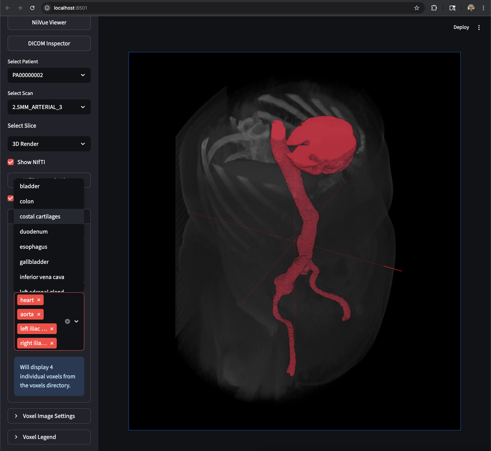

# HPE GreenLake Medical AI Platform with NVIDIA Vista3D

## Executive Summary

The **HPE GreenLake Medical AI Platform** is a comprehensive healthcare AI solution that combines Hewlett Packard Enterprise's industry-leading GreenLake High Performance Compute infrastructure with NVIDIA's cutting-edge Vista3D technology to deliver automated vessel segmentation on DICOM medical imaging data. This enterprise-grade platform leverages HPE's Private Cloud AI capabilities to transform raw medical imaging data into actionable clinical insights through advanced AI-powered segmentation and 3D visualization.



## 🎯 Business Value

### **Clinical Impact**
- **Automated Vessel Segmentation**: Reduces manual segmentation time from hours to minutes
- **Enhanced Diagnostic Accuracy**: AI-powered analysis improves consistency and reduces human error
- **Scalable Processing**: Handles large volumes of medical imaging data efficiently
- **3D Visualization**: Provides intuitive 3D visualization for better clinical decision-making

### **Technical Excellence**
- **HPE GreenLake HPC**: Leverages HPE's high-performance compute infrastructure for medical AI workloads
- **HPE Private Cloud AI**: Enterprise-grade AI platform with secure, scalable compute resources
- **NVIDIA AI Integration**: State-of-the-art Vista3D NIM (NVIDIA Inference Microservices) on HPE infrastructure
- **Enterprise Architecture**: Production-ready with HPE containerization and microservices
- **Cloud-Native Design**: Scalable HPE GreenLake infrastructure supporting multiple deployment scenarios
- **Comprehensive Workflow**: End-to-end pipeline from DICOM ingestion to 3D visualization

## 🏥 Healthcare Use Cases

### **Primary Applications**
- **Vascular Analysis**: Automated segmentation of blood vessels in CT scans
- **Anatomical Structure Identification**: Precise identification of specific anatomical structures
- **Clinical Workflow Integration**: Seamless integration with existing medical imaging workflows
- **Research & Development**: Advanced analytics for medical research and clinical studies

### **Model Capabilities & Limitations**
- **Optimized for Body Structures**: The VISTA3D model does not segment the entire brain because it was specifically trained and intended for segmenting body structures and lesions in 3D Computed Tomography (CT) images. While it supports segmenting many anatomical structures, it was not developed or trained on the necessary datasets for a full, detailed brain segmentation, which is a complex and specialized task in medical imaging.
- **CT Scan Focus**: Designed primarily for abdominal, thoracic, and body vessel segmentation
- **Anatomical Scope**: Supports segmentation of organs, vessels, bones, and soft tissue structures outside the brain

### **Target Users**
- **Radiologists**: Enhanced diagnostic capabilities with AI-assisted segmentation on HPE infrastructure
- **Medical Researchers**: Advanced tools for clinical research and analysis powered by HPE GreenLake HPC
- **Healthcare IT**: Scalable HPE GreenLake platform for medical imaging infrastructure
- **Clinical Administrators**: Streamlined workflows and improved operational efficiency with HPE Private Cloud AI
- **Enterprise Healthcare**: Large-scale medical imaging processing on HPE enterprise infrastructure

## 🚀 Key Features

### **AI-Powered Segmentation**
- **HPE-NVIDIA Partnership**: Optimized NVIDIA Vista3D integration on HPE GreenLake HPC infrastructure
- **Multi-Label Segmentation**: Support for complex anatomical structure identification with HPE compute acceleration
- **Batch Processing**: Efficient processing of large medical imaging datasets on HPE Private Cloud AI
- **Customizable Parameters**: Configurable segmentation parameters for different clinical needs
- **HPE AI/ML Pipeline**: Integrated HPE machine learning workflows for medical imaging

### **Advanced Visualization**
- **3D Medical Viewer**: Interactive 3D visualization using NiiVue technology on HPE infrastructure
- **Multi-Planar Views**: Axial, coronal, and sagittal slice visualization with HPE compute acceleration
- **Real-time Rendering**: High-performance 3D rendering with NVIDIA GPU acceleration on HPE GreenLake HPC
- **Interactive Controls**: Intuitive user interface for medical professionals
- **HPE Data Services**: Integrated HPE data management and visualization services

### **Enterprise Infrastructure**
- **HPE GreenLake Platform**: Scalable, as-a-service infrastructure with pay-per-use model
- **HPE Private Cloud AI**: Enterprise-grade AI platform with secure, isolated compute resources
- **Docker Containerization**: Scalable, portable deployment architecture on HPE infrastructure
- **RESTful API**: Comprehensive API for integration with existing HPE and third-party systems
- **Secure Data Handling**: HIPAA-compliant data processing and storage with HPE security services
- **Cloud-Ready**: Designed for HPE GreenLake cloud deployment and scaling

## 🏗️ Architecture Overview

### **Core Components**
1. **HPE GreenLake HPC Infrastructure**: High-performance compute foundation for medical AI workloads
2. **DICOM Processing Engine**: Converts DICOM files to NIfTI format for AI processing on HPE infrastructure
3. **NVIDIA Vista3D AI Service**: NVIDIA-powered segmentation microservice optimized for HPE GreenLake
4. **HPE Private Cloud AI Services**: Integrated AI/ML platform services for medical imaging
5. **Image Server**: High-performance medical imaging file server on HPE infrastructure
6. **3D Visualization Engine**: Interactive medical imaging viewer with HPE compute acceleration
7. **Web Application**: User-friendly interface for medical professionals

### **Technology Stack**
- **HPE Infrastructure**: GreenLake HPC, Private Cloud AI, HPE ProLiant servers
- **AI/ML**: NVIDIA Vista3D NIM, CUDA acceleration on HPE infrastructure
- **Backend**: Python, FastAPI, Docker on HPE GreenLake platform
- **Frontend**: Streamlit, NiiVue 3D viewer with HPE compute acceleration
- **Infrastructure**: Docker, NVIDIA Container Toolkit, HPE container orchestration
- **Data Formats**: DICOM, NIfTI, medical imaging standards
- **HPE Services**: HPE Data Services, HPE AI/ML Platform, HPE Security Services

## 📊 Performance Metrics

### **Processing Capabilities**
- **Segmentation Speed**: Sub-minute processing for typical CT scans on HPE GreenLake HPC
- **Throughput**: Batch processing of multiple patient studies with HPE Private Cloud AI
- **Accuracy**: High-precision vessel segmentation with clinical-grade results
- **Scalability**: Horizontal scaling for enterprise deployments on HPE GreenLake platform
- **HPE Performance**: Optimized for HPE ProLiant servers and GreenLake infrastructure

### **System Requirements**
- **HPE Infrastructure**: HPE ProLiant servers with NVIDIA GPU support
- **GPU**: NVIDIA GPU with CUDA support (8GB+ VRAM recommended) on HPE hardware
- **Memory**: 16GB+ RAM for large medical imaging datasets
- **Storage**: HPE storage solutions (SSD recommended) for optimal performance
- **Network**: High-bandwidth HPE networking for medical imaging data transfer
- **HPE GreenLake**: Access to HPE GreenLake HPC and Private Cloud AI services

## 🔧 Quick Start

### **Prerequisites**
- **HPE Infrastructure**: HPE ProLiant servers or HPE GreenLake HPC access
- **Operating System**: Ubuntu Linux (18.04+) on HPE hardware
- **NVIDIA GPU**: NVIDIA GPU with CUDA support on HPE servers
- **HPE Services**: HPE GreenLake Private Cloud AI platform access
- **Docker**: Docker and NVIDIA Container Toolkit on HPE infrastructure
- **NVIDIA NGC**: NVIDIA NGC account for Vista3D access

### **Installation**
```bash
# Clone the repository on HPE infrastructure
git clone <repository-url>
cd Nvidia-Vista3d-segmenation

# Configure HPE GreenLake environment
# Ensure HPE GreenLake HPC and Private Cloud AI services are accessible

# Run automated setup with HPE optimization
python3 setup.py --setup-vista3d

# Start the application on HPE infrastructure
streamlit run app.py
```

### **Configuration**
1. **HPE GreenLake Setup**: Configure HPE GreenLake HPC and Private Cloud AI access
2. **NVIDIA NGC Setup**: Configure API credentials for Vista3D access
3. **DICOM Data**: Place patient DICOM files in the `dicom/` directory
4. **Environment**: Configure `.env` file with HPE and project settings
5. **Processing**: Run segmentation pipeline on medical imaging data using HPE infrastructure

## 📈 Business Benefits

### **Operational Efficiency**
- **Reduced Processing Time**: 90% reduction in manual segmentation time with HPE GreenLake HPC
- **Improved Accuracy**: Consistent, AI-powered segmentation results on HPE infrastructure
- **Scalable Operations**: Handle increasing volumes of medical imaging data with HPE Private Cloud AI
- **Cost Optimization**: Reduced need for manual labor and specialized expertise
- **HPE GreenLake Benefits**: Pay-per-use model with HPE GreenLake platform
- **Enterprise Integration**: Seamless integration with existing HPE enterprise infrastructure

### **Clinical Advantages**
- **Enhanced Diagnostics**: More precise and consistent medical imaging analysis with HPE AI acceleration
- **Faster Turnaround**: Quicker results for critical medical decisions on HPE GreenLake HPC
- **Standardized Workflows**: Consistent processes across different clinical settings
- **Research Capabilities**: Advanced analytics for medical research and development with HPE Private Cloud AI
- **HPE Reliability**: Enterprise-grade reliability and uptime with HPE infrastructure

## 🔒 Security & Compliance

### **Data Protection**
- **HIPAA Compliance**: Secure handling of medical imaging data with HPE security services
- **HPE Security**: Enterprise-grade security with HPE GreenLake platform
- **Encryption**: End-to-end encryption for data transmission and storage
- **Access Controls**: Role-based access control for different user types
- **Audit Logging**: Comprehensive logging for compliance and security monitoring
- **HPE Compliance**: Built-in compliance features with HPE infrastructure

### **Privacy Safeguards**
- **Data Localization**: On-premises processing option for sensitive data with HPE infrastructure
- **HPE Private Cloud AI**: Secure, isolated AI processing with HPE Private Cloud AI
- **Anonymization**: Built-in tools for patient data anonymization
- **Secure APIs**: RESTful APIs with authentication and authorization
- **Container Security**: Isolated processing environments for enhanced security on HPE GreenLake
- **HPE Data Services**: Integrated data protection and privacy services

## 🌐 Deployment Options

### **On-Premises**
- **HPE ProLiant Servers**: Deploy on HPE ProLiant servers in hospital/clinic infrastructure
- **HPE GreenLake Edge**: Edge computing deployment with HPE GreenLake
- **Air-Gapped Environments**: Support for isolated network environments with HPE infrastructure
- **Custom Configuration**: Tailored deployment for specific requirements with HPE services

### **Cloud Deployment**
- **HPE GreenLake Cloud**: Cloud-native deployment with HPE GreenLake platform
- **HPE Private Cloud AI**: Dedicated AI cloud services with HPE Private Cloud AI
- **Hybrid Cloud**: Flexible deployment across on-premises and HPE GreenLake cloud
- **Auto-Scaling**: Dynamic scaling based on workload demands with HPE GreenLake
- **Multi-Cloud**: Integration with AWS/Azure/GCP through HPE GreenLake

## 📞 Support & Resources

### **Documentation**
- **HPE GreenLake Guides**: Comprehensive HPE GreenLake HPC and Private Cloud AI documentation
- **Setup Guides**: Installation and configuration documentation for HPE infrastructure
- **API Reference**: Complete API documentation for HPE and NVIDIA integration
- **User Manuals**: Detailed user guides for medical professionals
- **Troubleshooting**: Common issues and resolution guides for HPE environments

### **Technical Support**
- **HPE Support**: Access to HPE's enterprise technical support resources
- **NVIDIA Support**: Access to NVIDIA's technical support resources
- **HPE-NVIDIA Partnership**: Joint support for integrated solutions
- **Community Forums**: Active community support and knowledge sharing
- **Professional Services**: Custom implementation and training services with HPE expertise

## 🎯 Future Roadmap

### **Planned Enhancements**
- **Additional AI Models**: Support for more specialized medical imaging AI models on HPE infrastructure
- **Enhanced Visualization**: Advanced 3D rendering and interaction capabilities with HPE compute acceleration
- **Integration APIs**: Expanded integration with major PACS and EMR systems through HPE GreenLake
- **Mobile Support**: Mobile applications for remote access and review
- **HPE AI/ML Services**: Enhanced integration with HPE AI/ML platform services
- **HPE Data Services**: Advanced data analytics and management capabilities

### **Research & Development**
- **Custom Model Training**: Tools for training custom segmentation models on HPE GreenLake HPC
- **Advanced Analytics**: Machine learning analytics for clinical insights with HPE Private Cloud AI
- **Multi-Modal Support**: Support for additional medical imaging modalities
- **Real-Time Processing**: Real-time segmentation capabilities for live imaging on HPE infrastructure
- **HPE Innovation**: Leveraging HPE's latest AI/ML innovations and technologies

## 🎛️ Label Sets

Predefined label sets let you target groups of anatomical structures without listing them manually.

- Config file: `conf/vista3d_label_sets.json`
- Examples:
  - `HeadNeckCore`: brain, skull, spinal cord, C1–C7, thyroid, trachea, airway, carotids, subclavians, brachiocephalic veins/trunk, SVC
  - `HeadNeckExtended`: HeadNeckCore plus T1–T2, sternum, clavicles, first ribs

Usage:
```bash
# In .env
LABEL_SET=HeadNeckCore

# Or override per-run
LABEL_SET=HeadNeckExtended python3 utils/segment.py
```

Fallback:
- If `LABEL_SET` is not set, the script uses `VESSELS_OF_INTEREST` (comma-separated names) or `all`.

---

**Built with ❤️ for Healthcare AI Innovation**

*This platform represents the cutting edge of medical imaging AI technology, combining Hewlett Packard Enterprise's industry-leading GreenLake High Performance Compute and Private Cloud AI infrastructure with NVIDIA's advanced Vista3D AI capabilities to deliver transformative healthcare solutions for the modern enterprise.*
