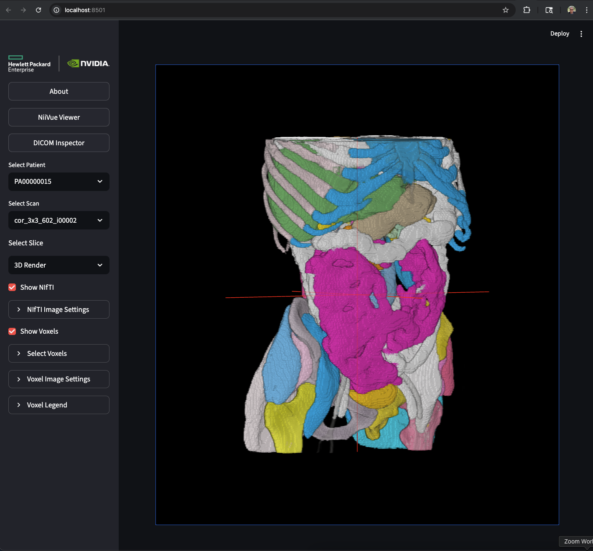
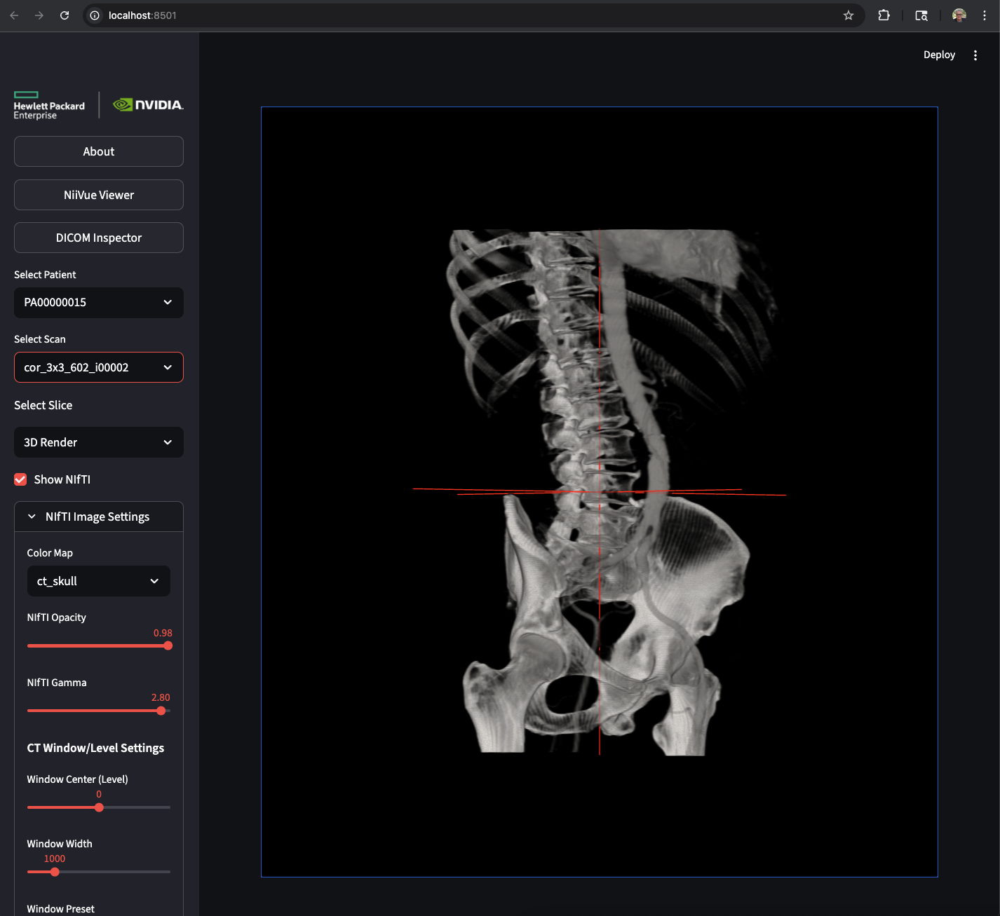

# HPE Medical Imaging AI Segmentation with NVIDIA Vista3D

A medical imaging AI platform that combines HPE High Performance Compute infrastructure with NVIDIA's Vista3D technology for automated vessel segmentation on DICOM medical imaging data.

  

## Overview

This platform provides automated vessel segmentation using NVIDIA's Vista3D model on HPE infrastructure, transforming DICOM medical imaging data into actionable clinical insights through AI-powered segmentation and 3D visualization.

## Key Features

- **AI-Powered Segmentation**: NVIDIA Vista3D model for automated vessel and anatomical structure segmentation
- **3D Visualization**: Interactive 3D medical viewer using NiiVue technology
- **Multi-Planar Views**: Axial, coronal, and sagittal slice visualization
- **Batch Processing**: Efficient processing of large medical imaging datasets
- **HPE Infrastructure**: Optimized for HPE GreenLake HPC and Private Cloud AI

## Model Capabilities

- **CT Scan Focus**: Designed for abdominal, thoracic, and body vessel segmentation
- **Anatomical Scope**: Supports segmentation of organs, vessels, bones, and soft tissue structures
- **Limitation**: Does not segment the entire brain (optimized for body structures and lesions)

### Technology Stack
- **Infrastructure**: HPE GreenLake HPC, Private Cloud AI, HPE ProLiant servers
- **AI/ML**: NVIDIA Vista3D NIM, CUDA acceleration
- **Backend**: Python, FastAPI, Docker
- **Frontend**: Streamlit, NiiVue 3D viewer
- **Data Formats**: DICOM, NIfTI

## System Requirements

### For Backend Setup (Vista3D Server):
- **OS**: Ubuntu Linux (18.04+) or macOS
- **GPU**: NVIDIA GPU with CUDA support (8GB+ VRAM recommended)
- **Memory**: 16GB+ RAM for large medical imaging datasets
- **Storage**: 40GB+ free disk space (Vista3D Docker image is ~30GB)
- **Docker**: Docker and NVIDIA Container Toolkit (required)
- **NVIDIA NGC**: Account for Vista3D access

### For Frontend Setup (Web Interface):
- **OS**: Ubuntu Linux (18.04+) or macOS
- **Memory**: 8GB+ RAM (minimum)
- **Docker**: Docker (required)
- **NVIDIA NGC**: Not required (connects to remote Vista3D server)

## 🚀 Quick Start

### Recommended Setup: Remote Backend + Local Frontend

**The recommended deployment:**
- **Backend**: Remote Ubuntu server with NVIDIA GPUs
- **Frontend**: Local Mac or workstation  
- **Connection**: SSH tunnels

### Setup Instructions

#### 1. Backend Setup (Ubuntu Server with GPU)

```bash
cd backend
python3 setup.py
docker compose up -d
```

The setup will:
- ✅ Check system requirements (Docker, NVIDIA GPU, NVIDIA Container Toolkit)
- ✅ Request your NVIDIA NGC API key
- ✅ Create necessary directories and configuration
- ✅ Pull Vista3D Docker image (~30GB)

#### 2. Frontend Setup (Your Mac)

```bash
cd frontend
python3 setup.py
```

The setup will:
- ✅ Check Docker installation
- ✅ Create necessary directories
- ✅ Pull Docker images for frontend and image server
- ✅ Create configuration files

#### 3. Connect and Run (Your Mac)

**Terminal 1 - SSH Tunnel:**
```bash
ssh -L 8000:localhost:8000 -R 8888:0.0.0.0:8888 user@ubuntu-server
```
Keep this terminal open!

**Terminal 2 - Start Frontend & Image Server:**
```bash
cd frontend
docker compose up -d
```

**Browser:**
Open http://localhost:8501

### Daily Usage

Once setup is complete, just run these commands:

**On Ubuntu Server:**
```bash
cd backend && docker compose up -d
```

**On Your Mac:**
```bash
# Terminal 1: SSH tunnel
ssh -L 8000:localhost:8000 -R 8888:0.0.0.0:8888 user@ubuntu-server

# Terminal 2: Frontend
cd frontend && docker compose up -d
```

**📚 See [SETUP.md](SETUP.md) for complete setup instructions**
**📋 See [QUICK_REFERENCE.md](QUICK_REFERENCE.md) for a quick command reference**

### Stop Services

```bash
# On Mac
cd frontend && docker compose down

# On Ubuntu Server
cd backend && docker compose down
```

### Kubernetes Deployment

```bash
# Deploy with Helm chart
cd helm/vista3d
helm install vista3d . --namespace vista3d --create-namespace
```

## What Gets Installed

### Backend Components
- 🧠 **Vista3D AI Server**: NVIDIA's medical imaging AI model
- 🐳 **Docker Container**: ~30GB Vista3D NIM image

### Frontend Components  
- 🌐 **Web Interface**: Streamlit-based UI for medical imaging
- 🖼️ **Image Server**: FastAPI server for DICOM/NIfTI file serving

## Using Vista3D

### Process Your Medical Images
```bash
# Sample data is automatically installed during setup (if available)
# The setup script installs sample medical imaging data for patient PA00000002

# For your own data:
# Option A: Place DICOM files in dicom/ folder
mkdir -p dicom/PA00000001
# Copy your DICOM files to dicom/PA00000001/

# Option B: Place NIFTI files directly
mkdir -p output/nifti
# Copy your .nii.gz files to output/nifti/

# Open your browser to http://localhost:8501
# Use the Tools page in the web interface to:
# - Convert DICOM to NIFTI
# - Run AI segmentation
# - View 3D visualizations
```

**🎉 That's it!** You now have a fully functional medical AI platform with distributed architecture.

## 💻 Development Environments

For development work, you can use separate virtual environments to avoid downloading heavy ML dependencies when working on the frontend:

### Quick Development Setup
```bash
# Frontend environment (lightweight, no Triton/PyTorch)
uv venv .venv-frontend
source .venv-frontend/bin/activate
uv pip install python-dotenv nibabel numpy tqdm requests beautifulsoup4 bs4 streamlit fastapi uvicorn pandas plotly streamlit-mermaid dcm2niix vtk trimesh pymeshfix stl extra-streamlit-components scikit-image plyfile
streamlit run app.py

# Backend environment (full AI stack)
uv venv .venv-backend
source .venv-backend/bin/activate
uv pip install python-dotenv numpy tqdm requests beautifulsoup4 bs4 nibabel dcm2niix vtk trimesh pymeshfix stl scikit-image plyfile
cd backend && docker-compose up -d
```

See the [docs/SETUP_GUIDE.md](docs/SETUP_GUIDE.md) for detailed development environment setup.

## 🌐 Deployment Scenarios

The platform supports multiple deployment configurations based on your infrastructure:

### Scenario 1: Single GPU Machine (Full Stack)
```bash
# Setup everything on one GPU-enabled machine
python3 setup.py

# Start all services
# Backend (GPU machine)
cd backend && docker-compose up -d

# Frontend (any machine)
cd frontend
cd ../image_server && docker-compose up -d
cd ../frontend && docker-compose up -d
```
**Best for**: Development, testing, small-scale deployments

### Scenario 2: Frontend-Only (Non-GPU Machine)
```bash
# Setup only frontend on non-GPU machine
python3 setup.py --setup frontend

# Start frontend services
cd frontend
# Start image server first
cd ../image_server && docker-compose up -d
# Start frontend
cd ../frontend && docker-compose up -d
```
**Best for**: Web interfaces on non-GPU systems, connecting to remote Vista3D

### Scenario 3: Backend-Only (GPU Machine)
```bash
# Setup only backend on GPU machine
python3 setup.py --setup backend

# Start backend services
cd backend && ./start_backend.sh
```
**Best for**: GPU servers providing Vista3D API to multiple frontends

### Scenario 4: Distributed (Remote Vista3D)
For remote Vista3D server deployments, you'll need to set up port forwarding:

#### SSH Port Forwarding
```bash
# Forward local ports to remote Vista3D server
ssh user@remote_server -L 8000:localhost:8000 -R 8888:localhost:8888

# This forwards:
# - Local port 8000 → Remote Vista3D server port 8000
# - Remote port 8888 → Local image server port 8888
```

#### VPN and Secure Network Access

When the Vista3D backend is behind a VPN or firewall, SSH tunneling provides secure access:

```bash
# 1. Connect to your organization's VPN
# 2. Establish SSH tunnel through VPN
ssh user@vpn_server -L 8000:localhost:8000 -R 8888:localhost:8888

# 3. Configure frontend to use tunneled ports
echo "VISTA3D_SERVER=http://localhost:8000" >> .env
echo "IMAGE_SERVER=http://localhost:8888" >> .env
```

**Benefits for VPN environments:**
- 🔒 **Security**: Encrypts all traffic between frontend and backend
- 🚪 **Firewall Bypass**: Works through corporate firewalls and VPNs
- 🏠 **Local Access**: Makes backend services accessible on localhost
- 🔐 **No Direct Access**: Frontend doesn't need direct VPN access

#### Configuration for Remote Vista3D
```bash
# Edit .env file to point to remote server
VISTA3D_SERVER="http://localhost:8000"  # Uses SSH tunnel
IMAGE_SERVER="http://localhost:8888"    # Local image server
```

### Deployment Options Summary
- **Same Machine**: Run both Vista3D and frontend on the same GPU-enabled machine
- **Frontend-Only**: Run frontend on any machine, connect to remote Vista3D
- **Backend-Only**: Run Vista3D on GPU server, provide API to multiple frontends
- **Distributed**: Run Vista3D and frontend on different machines with proper networking

## 🛠️ Using the Tools Page

The web interface includes a powerful **Tools page** where you can:

- **Convert DICOM to NIFTI**: Upload DICOM files and convert them to NIFTI format
- **Run AI Segmentation**: Process NIFTI files with the Vista3D AI model
- **View 3D Visualizations**: Interactive 3D medical viewer with multi-planar views
- **Batch Processing**: Process multiple patients and studies at once
- **Download Results**: Export segmentation results and 3D models

**Access the Tools page**: Navigate to http://localhost:8501 and click on the "Tools" tab in the sidebar.

## 📋 What You Get

After running the setup and start scripts, you'll have:

- **Complete Medical AI Platform**: All services running in Docker containers
- **Web Interface**: Easy-to-use Streamlit interface with Tools page for image processing
- **AI Segmentation**: NVIDIA Vista3D model for automated vessel segmentation
- **3D Visualization**: Interactive 3D medical viewer
- **Batch Processing**: Process multiple patients and studies through the GUI
- **API Access**: RESTful API for integration with other systems
- **Sample Data**: Pre-installed sample medical imaging data for testing (if available)

## 🔧 Management Commands

### Master Platform Management
```bash
# Start all services (if both frontend and backend were set up)
# Backend (GPU machine)
cd backend && docker-compose up -d

# Frontend (any machine)
cd frontend
cd ../image_server && docker-compose up -d
cd ../frontend && docker-compose up -d

# Stop all services
cd backend && docker-compose down
cd ../frontend && docker-compose down
cd ../image_server && docker-compose down

# Check service status
docker-compose ps
```

### Individual Service Management

#### Backend (Vista3D Server) Management
```bash
# Start Vista3D server
cd backend && ./start_backend.sh

# Stop Vista3D server
cd backend && docker-compose down

# View Vista3D logs
cd backend && docker logs -f vista3d-server-standalone

# Restart Vista3D server
cd backend && docker-compose restart
```

#### Frontend Services Management
```bash
# Start frontend services
cd frontend
# Start image server first
cd ../image_server && docker-compose up -d
# Start frontend
cd ../frontend && docker-compose up -d

# Stop frontend services
cd frontend && docker-compose down && cd ../image_server && docker-compose down

# View frontend logs
cd frontend && docker-compose logs -f
cd frontend && docker logs -f vista3d-image-server-standalone
```

### Systemd Service Management (Production)
```bash
# Create systemd services for auto-startup
# Note: Systemd service creation is not available in the current version
# Use Docker Compose with restart policies instead:
# Add 'restart: unless-stopped' to docker-compose.yml files

# Start services using Docker Compose
cd backend && docker-compose up -d
cd ../frontend
cd ../image_server && docker-compose up -d
cd ../frontend && docker-compose up -d

# Check service status
docker-compose ps
```

## ⚠️ Command Line Utilities (Advanced Users Only)

The `utils/` directory contains command-line scripts for advanced users who need programmatic access:

```bash
# These are for advanced users only - use the Tools page instead
python3 utils/dicom2nifti.py    # DICOM to NIFTI conversion
python3 utils/segment.py        # Vista3D segmentation processing
python3 utils/nifti2ply.py      # NIFTI to PLY conversion
```

**Recommended**: Use the **Tools page** in the web interface (http://localhost:8501) for all image processing tasks.

## 📁 Project Structure

```
HPE-Nvidia-Vista-3D/
├── setup.py              # Unified setup script
├── backend/              # Vista3D backend service
├── frontend/             # Streamlit frontend service
├── image_server/         # Image server service
├── app.py                # Main Streamlit web application
├── .env                  # Environment configuration (created by setup)
├── dicom/                # DICOM files (patient folders: PA*, SER*)
├── output/               # Generated files
│   ├── nifti/           # Converted NIFTI files
│   ├── scans/           # Scan results
│   └── voxels/          # Voxel data
│       └── {scan_name}/
│           └── original/ # Original segmented voxel files
├── utils/               # Utility scripts (for advanced users)
│   ├── dicom2nifti.py   # DICOM to NIFTI conversion (use Tools page instead)
│   ├── segment.py       # Vista3D segmentation processing (use Tools page instead)
│   └── nifti2ply.py     # NIFTI to PLY conversion (use Tools page instead)
└── conf/                # Configuration files
```

## 🛠️ Advanced Configuration

### Custom Configuration
Edit the `.env` file created during setup:

```bash
# Vista3D server (local or remote)
VISTA3D_SERVER="http://localhost:8000"  # Local
# VISTA3D_SERVER="http://remote-server:8000"  # Remote

# Segmentation targets
VESSELS_OF_INTEREST="all"  # or specific structures

# Custom paths
DICOM_FOLDER="/path/to/your/dicom"
OUTPUT_FOLDER="/path/to/your/output"
```

### Remote Vista3D Server
If you want to use a remote Vista3D server instead of running it locally:

```bash
# Edit .env file
VISTA3D_SERVER="http://localhost:8000"  # Uses SSH tunnel
NGC_API_KEY="your_nvidia_api_key"

# Set up SSH port forwarding
ssh user@remote_server -L 8000:localhost:8000 -R 8888:localhost:8888

# Start only frontend services
cd frontend
cd ../image_server && docker-compose up -d
cd ../frontend && docker-compose up -d
```

## 🔍 Troubleshooting

### Common Issues

**Vista3D Not Starting**
```bash
# Check GPU availability
nvidia-smi

# Check Docker GPU support
docker run --rm --gpus all nvidia/cuda:11.8.0-base-ubuntu22.04 nvidia-smi

# Check Vista3D logs
docker logs -f vista3d
```

**Permission Issues**
```bash
# Fix file permissions
sudo chown -R $USER:$USER output/
sudo chmod -R 755 output/
```

**Port Already in Use**
```bash
# Check what's using the ports
lsof -i :8501
lsof -i :8888
lsof -i :8000

# Stop conflicting services
sudo systemctl stop conflicting-service
```

### Getting Help
1. Check the logs for error messages
2. Verify system requirements
3. Try rerunning the setup script
4. Check NVIDIA NGC documentation

## 📊 Performance Tips

- **GPU Memory**: Ensure 8GB+ VRAM for optimal performance
- **System Memory**: 16GB+ RAM recommended for large datasets
- **Storage**: Use SSD storage for faster processing
- **Network**: Stable connection required for initial setup

## 🔒 Security Notes

- **API Keys**: Never commit `.env` file to version control
- **Data Privacy**: All processing happens locally
- **Network**: Services run on localhost by default
- **File Access**: Containers have access to project directories only

## 🌐 Remote Access

To allow external access to your platform:

```bash
# Find your public IP
curl ifconfig.me

# Update .env file
IMAGE_SERVER="http://your-public-ip:8888"

# Ensure firewall allows ports
sudo ufw allow 8501
sudo ufw allow 8888
sudo ufw allow 8000
```

## 📚 Additional Resources

- **Setup Guide**: See [docs/SETUP_GUIDE.md](docs/SETUP_GUIDE.md) for comprehensive setup guide and options
- **Helm Chart**: See [docs/HELM.md](docs/HELM.md) for Kubernetes deployment with Helm
- **Full Documentation**: See `docs/` directory for detailed guides
- **API Reference**: Check `utils/` directory for script documentation
- **HPE GreenLake**: Learn about HPE infrastructure integration
- **NVIDIA NGC**: Access Vista3D models and documentation

---

**Need Help?** Check the troubleshooting section or refer to the full documentation in the `docs/` directory.

**Ready to Go?** Follow the Quick Start steps above and you'll be up and running in 15 minutes! 🚀

---

**Built with ❤️ for Healthcare AI Innovation**
