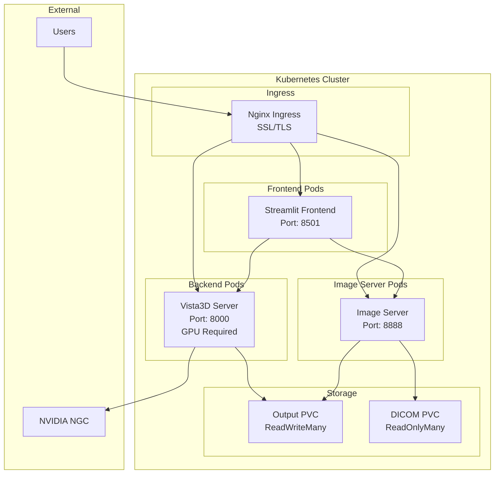

# HPE NVIDIA Vista3D Helm Chart Documentation

## 📋 Overview

The HPE NVIDIA Vista3D Helm chart provides a complete Kubernetes deployment solution for the Vista3D Medical AI Platform. This chart deploys three main components: the Vista3D backend server, Streamlit frontend, and image server, all configured for production-ready medical imaging workloads.

**Chart Version**: 1.1.0  
**App Version**: 1.1.0  
**Kubernetes**: 1.19+  
**Helm**: 3.0+

## 🏗️ Architecture

The Helm chart deploys a microservices architecture with the following components:



### Components

| Component | Purpose | Port | Resources | Scaling |
|-----------|---------|------|-----------|---------|
| **Vista3D Backend** | AI-powered medical image segmentation | 8000 | GPU + 16Gi RAM | Single replica |
| **Streamlit Frontend** | Web interface for medical imaging | 8501 | 4Gi RAM | Horizontal scaling |
| **Image Server** | HTTP server for medical image files | 8888 | 2Gi RAM | Horizontal scaling |

## 🚀 Quick Start

### Prerequisites

1. **Kubernetes Cluster** (1.19+)
2. **Helm 3.0+**
3. **NVIDIA GPU Nodes** with Container Toolkit
4. **NVIDIA NGC Account** and API key
5. **Persistent Storage** (ReadWriteMany and ReadOnlyMany support)

### Basic Installation

```bash
# Clone the repository
git clone https://github.com/dw-flyingw/HPE-Nvidia-Vista-3D.git
cd HPE-Nvidia-Vista-3D/helm/vista3d

# Install with default values
helm install vista3d . --namespace vista3d --create-namespace

# Check deployment status
kubectl get pods -n vista3d
kubectl get svc -n vista3d
```

### Installation with Custom Configuration

```bash
# Install with custom values
helm install vista3d . \
  --namespace vista3d \
  --create-namespace \
  --set secrets.ngcApiKey="your-ngc-api-key" \
  --set ingress.enabled=true \
  --set ingress.hosts[0].host="vista3d.yourdomain.com"
```

### Production Installation

```bash
# Install with production values
helm install vista3d . \
  --namespace vista3d \
  --create-namespace \
  --values values-production.yaml \
  --set secrets.ngcApiKey="your-ngc-api-key"
```

## ⚙️ Configuration

### Global Configuration

```yaml
global:
  imageRegistry: ""              # Custom image registry
  imagePullSecrets: []           # Image pull secrets
  storageClass: ""               # Default storage class
```

### Backend Configuration

The Vista3D backend requires NVIDIA GPU nodes and specific configuration:

```yaml
backend:
  enabled: true
  replicaCount: 1
  
  image:
    repository: nvcr.io/nim/nvidia/vista3d
    tag: "1.0.0"
    pullPolicy: IfNotPresent
  
  resources:
    limits:
      nvidia.com/gpu: 1
      memory: "16Gi"
      cpu: "4"
    requests:
      nvidia.com/gpu: 1
      memory: "8Gi"
      cpu: "2"
  
  nodeSelector:
    nvidia.com/gpu: "true"
  
  tolerations:
    - key: nvidia.com/gpu
      operator: Exists
      effect: NoSchedule
  
  env:
    - name: NGC_API_KEY
      valueFrom:
        secretKeyRef:
          name: vista3d-secrets
          key: ngc-api-key
    - name: WORKSPACE_OUTPUTS_PATH
      value: "/workspace/output"
    - name: IMAGE_SERVER
      value: "http://vista3d-image-server:8888"
```

### Frontend Configuration

The Streamlit frontend provides the web interface:

```yaml
frontend:
  enabled: true
  replicaCount: 2
  
  image:
    repository: dwtwp/vista3d-frontend
    tag: latest
    pullPolicy: IfNotPresent
  
  resources:
    limits:
      memory: "4Gi"
      cpu: "2"
    requests:
      memory: "2Gi"
      cpu: "1"
  
  env:
    - name: VISTA3D_SERVER
      value: "http://vista3d-backend:8000"
    - name: IMAGE_SERVER
      value: "http://vista3d-image-server:8888"
    - name: OUTPUT_FOLDER
      value: "/app/output"
    - name: DICOM_FOLDER
      value: "/app/dicom"
```

### Image Server Configuration

The image server handles medical image file serving:

```yaml
imageServer:
  enabled: true
  replicaCount: 1
  
  image:
    repository: dwtwp/vista3d-image-server
    tag: latest
    pullPolicy: IfNotPresent
  
  resources:
    limits:
      memory: "2Gi"
      cpu: "1"
    requests:
      memory: "1Gi"
      cpu: "0.5"
  
  env:
    - name: OUTPUT_FOLDER
      value: "/data/output"
    - name: DICOM_FOLDER
      value: "/data/dicom"
```

### Ingress Configuration

Configure external access with ingress:

```yaml
ingress:
  enabled: true
  className: "nginx"
  annotations:
    nginx.ingress.kubernetes.io/ssl-redirect: "true"
    nginx.ingress.kubernetes.io/proxy-body-size: "500m"
    nginx.ingress.kubernetes.io/proxy-read-timeout: "600"
    nginx.ingress.kubernetes.io/enable-cors: "true"
    cert-manager.io/cluster-issuer: "letsencrypt-prod"
  
  hosts:
    - host: vista3d.yourdomain.com
      paths:
        - path: /
          pathType: Prefix
          service: vista3d-frontend
        - path: /api/vista3d
          pathType: Prefix
          service: vista3d-backend
        - path: /images
          pathType: Prefix
          service: vista3d-image-server
        - path: /health
          pathType: Prefix
          service: vista3d-image-server
  
  tls:
    - secretName: vista3d-tls
      hosts:
        - vista3d.yourdomain.com
```

### Persistent Storage Configuration

Configure persistent volumes for data storage:

```yaml
persistence:
  enabled: true
  storageClass: "fast-ssd"
  
  output:
    enabled: true
    storageClass: "fast-ssd"
    accessMode: ReadWriteMany
    size: 100Gi
  
  dicom:
    enabled: true
    storageClass: "standard"
    accessMode: ReadOnlyMany
    size: 50Gi
```

## 🔧 Advanced Configuration

### GPU Node Requirements

The backend requires NVIDIA GPU nodes with specific labels and taints:

```yaml
# Node labels
nvidia.com/gpu: "true"
node-type: "gpu"

# Node taints
nvidia.com/gpu: NoSchedule
gpu-workload: NoSchedule
```

### Resource Optimization

#### Production Resource Allocation

```yaml
# Backend (GPU-intensive)
backend:
  resources:
    limits:
      nvidia.com/gpu: 1
      memory: "32Gi"
      cpu: "8"
    requests:
      nvidia.com/gpu: 1
      memory: "16Gi"
      cpu: "4"

# Frontend (CPU-intensive)
frontend:
  replicaCount: 3
  resources:
    limits:
      memory: "8Gi"
      cpu: "4"
    requests:
      memory: "4Gi"
      cpu: "2"

# Image Server (I/O-intensive)
imageServer:
  replicaCount: 2
  resources:
    limits:
      memory: "4Gi"
      cpu: "2"
    requests:
      memory: "2Gi"
      cpu: "1"
```

### High Availability Configuration

```yaml
# Pod Disruption Budget
podDisruptionBudget:
  enabled: true
  minAvailable: 1

# Anti-affinity rules
frontend:
  affinity:
    podAntiAffinity:
      preferredDuringSchedulingIgnoredDuringExecution:
      - weight: 100
        podAffinityTerm:
          labelSelector:
            matchExpressions:
            - key: app.kubernetes.io/component
              operator: In
              values: ["frontend"]
          topologyKey: kubernetes.io/hostname

# Horizontal Pod Autoscaler
autoscaling:
  enabled: true
  minReplicas: 2
  maxReplicas: 20
  targetCPUUtilizationPercentage: 70
  targetMemoryUtilizationPercentage: 80
```

### Security Configuration

```yaml
# Security Context
podSecurityContext:
  fsGroup: 1000
  runAsUser: 1000
  runAsNonRoot: true
  seccompProfile:
    type: RuntimeDefault

securityContext:
  allowPrivilegeEscalation: false
  capabilities:
    drop:
    - ALL
  readOnlyRootFilesystem: false
  runAsNonRoot: true
  runAsUser: 1000

# Network Policy
networkPolicy:
  enabled: true
  ingress:
    - from:
      - namespaceSelector:
          matchLabels:
            name: ingress-nginx
      - namespaceSelector:
          matchLabels:
            name: monitoring
      ports:
      - protocol: TCP
        port: 8501
      - protocol: TCP
        port: 8888
      - protocol: TCP
        port: 8000
```

## 📊 Monitoring and Observability

### Health Checks

All components include comprehensive health checks:

```yaml
# Frontend health check
livenessProbe:
  httpGet:
    path: /
    port: http
  initialDelaySeconds: 30
  periodSeconds: 30

# Image server health check
livenessProbe:
  httpGet:
    path: /health
    port: http
  initialDelaySeconds: 30
  periodSeconds: 30
```

### Prometheus Monitoring

```yaml
monitoring:
  enabled: true
  serviceMonitor:
    enabled: true
    interval: 30s
    scrapeTimeout: 10s
    labels:
      release: prometheus
```

### Logging Configuration

```yaml
# Structured logging
env:
  - name: PYTHONUNBUFFERED
    value: "1"
  - name: PYTHONDONTWRITEBYTECODE
    value: "1"
```

## 🔒 Security Best Practices

### Secrets Management

```yaml
# Use external secret management in production
secrets:
  create: true
  # ngcApiKey: ""  # Set via external secret manager
```

### Service Account Configuration

```yaml
serviceAccount:
  create: true
  annotations:
    eks.amazonaws.com/role-arn: "arn:aws:iam::ACCOUNT:role/vista3d-role"
  name: "vista3d-service-account"
```

### Image Security

```yaml
# Use specific image tags (not latest in production)
images:
  frontend:
    tag: "v1.1.0"
  imageServer:
    tag: "v1.1.0"
  backend:
    tag: "1.0.0"
```

## 🚨 Troubleshooting

### Common Issues

#### 1. Backend Pod Not Starting

**Symptoms**: Backend pod stuck in `Pending` or `CrashLoopBackOff`

**Diagnosis**:
```bash
# Check pod status
kubectl get pods -n vista3d -l app.kubernetes.io/component=backend

# Check events
kubectl describe pod -n vista3d <backend-pod-name>

# Check GPU availability
kubectl get nodes -l nvidia.com/gpu=true
```

**Solutions**:
- Verify NVIDIA Container Toolkit is installed
- Check GPU node labels and taints
- Verify NGC API key in secrets
- Check resource limits

#### 2. Frontend Not Accessible

**Symptoms**: Frontend service not responding or ingress issues

**Diagnosis**:
```bash
# Check service endpoints
kubectl get endpoints -n vista3d

# Check ingress status
kubectl describe ingress -n vista3d

# Test internal connectivity
kubectl port-forward -n vista3d svc/vista3d-frontend 8501:8501
```

**Solutions**:
- Verify service selectors match pod labels
- Check ingress controller is running
- Verify DNS resolution
- Check firewall rules

#### 3. Image Server Issues

**Symptoms**: Image server not serving files or empty directories

**Diagnosis**:
```bash
# Check persistent volume claims
kubectl get pvc -n vista3d

# Check volume mounts
kubectl describe pod -n vista3d <image-server-pod-name>

# Test file access
kubectl exec -n vista3d <image-server-pod-name> -- ls -la /data/
```

**Solutions**:
- Verify PVC status and storage class
- Check file permissions on mounted volumes
- Verify data exists in source directories
- Check storage class supports required access modes

### Debug Commands

```bash
# Check all resources
kubectl get all -n vista3d

# Check persistent volumes
kubectl get pv,pvc -n vista3d

# Check events
kubectl get events -n vista3d --sort-by='.lastTimestamp'

# Check logs
kubectl logs -n vista3d -l app.kubernetes.io/component=backend
kubectl logs -n vista3d -l app.kubernetes.io/component=frontend
kubectl logs -n vista3d -l app.kubernetes.io/component=image-server

# Check resource usage
kubectl top pods -n vista3d
kubectl top nodes

# Check GPU usage
kubectl describe nodes -l nvidia.com/gpu=true
```

## 📈 Performance Optimization

### Resource Tuning

#### Memory Optimization

```yaml
# Adjust based on workload
backend:
  resources:
    requests:
      memory: "12Gi"  # Increase for large DICOM files
    limits:
      memory: "24Gi"

frontend:
  resources:
    requests:
      memory: "1Gi"   # Decrease for simple deployments
    limits:
      memory: "2Gi"
```

#### CPU Optimization

```yaml
# Scale based on concurrent users
frontend:
  replicaCount: 5     # Increase for high traffic
  resources:
    requests:
      cpu: "0.5"
    limits:
      cpu: "1"

autoscaling:
  enabled: true
  minReplicas: 3
  maxReplicas: 50
  targetCPUUtilizationPercentage: 60
```

### Storage Optimization

```yaml
# Use fast storage for output data
persistence:
  output:
    storageClass: "fast-ssd"  # NVMe or high-performance SSD
    size: 200Gi

# Use standard storage for DICOM data
persistence:
  dicom:
    storageClass: "standard"  # Cost-effective for read-only data
    size: 100Gi
```

## 🔄 Upgrade and Maintenance

### Chart Upgrades

```bash
# Check current version
helm list -n vista3d

# Upgrade to latest version
helm upgrade vista3d . -n vista3d

# Upgrade with custom values
helm upgrade vista3d . -n vista3d --values values-production.yaml

# Rollback if needed
helm rollback vista3d 1 -n vista3d
```

### Data Migration

```bash
# Backup persistent volumes before upgrade
kubectl exec -n vista3d <pod-name> -- tar czf /tmp/backup.tar.gz /workspace/output

# Restore after upgrade
kubectl exec -n vista3d <pod-name> -- tar xzf /tmp/backup.tar.gz -C /
```

### Maintenance Windows

```bash
# Scale down for maintenance
kubectl scale deployment vista3d-frontend -n vista3d --replicas=0

# Perform maintenance
# ...

# Scale back up
kubectl scale deployment vista3d-frontend -n vista3d --replicas=3
```

## 📚 Additional Resources

### Related Documentation

- [Setup Guide](SETUP_GUIDE.md) - Local development setup
- [Backend Guide](BACKEND_GUIDE.md) - Vista3D server configuration
- [Deployment Guide](DEPLOYMENT_GUIDE.md) - General deployment information
- [Docker Build](DOCKER_BUILD.md) - Container build instructions

### External Resources

- [Helm Documentation](https://helm.sh/docs/)
- [Kubernetes Documentation](https://kubernetes.io/docs/)
- [NVIDIA Container Toolkit](https://docs.nvidia.com/datacenter/cloud-native/container-toolkit/)
- [NVIDIA NGC](https://ngc.nvidia.com/)

### Support

For issues and support:
- GitHub Issues: [HPE-Nvidia-Vista-3D Repository](https://github.com/dw-flyingw/HPE-Nvidia-Vista-3D)
- Documentation: [Project Documentation](../docs/)
- HPE Healthcare AI Team: dave.wright@hpe.com

## 📄 License

This Helm chart is licensed under the Apache 2.0 License. See the [LICENSE](../LICENSE) file for details.
